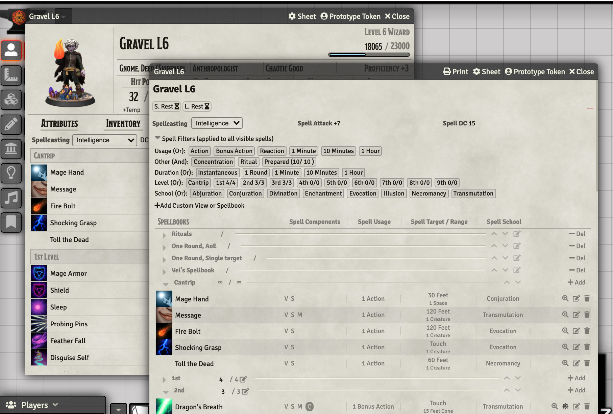
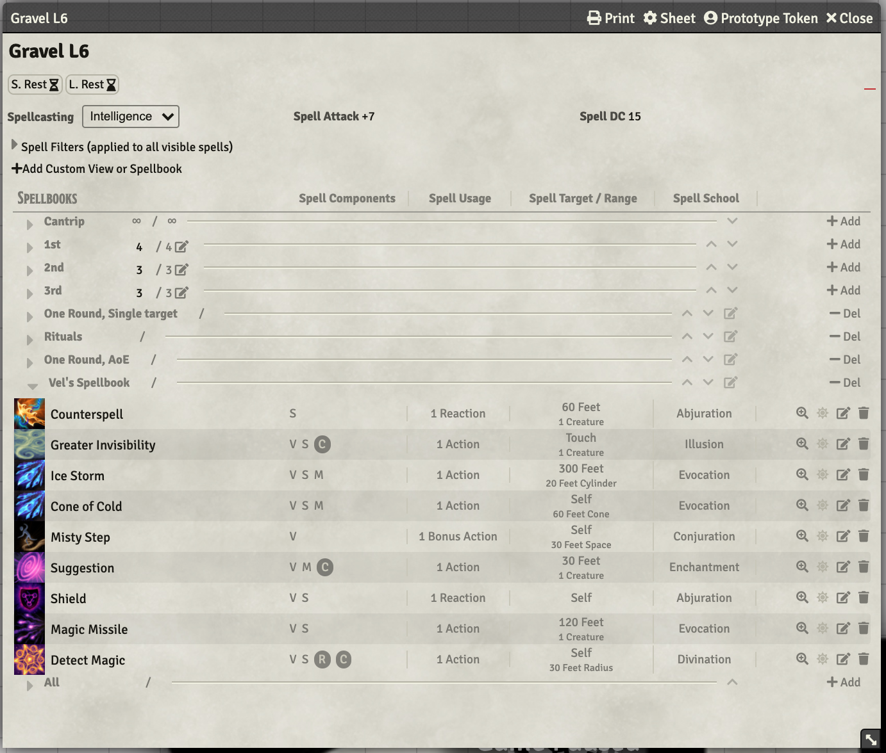

# Spetzel's Spell Better
The ultimate detachable spellbook for Wizards and other prepared-spell full casters (Druids and Clerics).

- Switch your character sheet to the Spell Better sheet for a full OGL-5e sheet with Spell Better spellbook
- OR Detach the Spell Better Spellbook by clicking the Spellbook tab from any supported character sheet
- See a one-line spell-slot summary as well as how many spells you can and have prepared
- Filter your spell list by level, school, usage, duration, prepared, concentration, and ritual
- Create custom Views like <strong>Utility Spells</strong>, <strong>AoE Nukes</strong>, <strong>Traveling</strong>, or <strong>Dungeoneering</strong>
- Create separate Spellbooks like <strong>Wanted</strong>, <strong>Found Scrolls</strong>, or <strong>Green Spellbook(deciphered)</strong>
- Easily print your Spellbook with custom views and sub-spellbooks, for quick reference at the screen or at the table

## Summary
* **Authors**: Discord: Spetzel#0103, [Calego#0914](https://github.com/ElfFriend-DnD)
* **Version**: 0.8.2
* **Foundry VTT Compatibility**: 0.7.2-0.7.9
* **System Compatibility (If applicable)**: dnd5e
* **Translation Support**: en

Spell Better is a forked version of https://github.com/ElfFriend-DnD/foundryvtt-5eOGLCharacterSheet, itself "heavily inspired by the Official 5e Character Sheet and the Roll20 default 5e Sheet. This sheet is chaotic and packed with information all on one screen, but it does have the advantage of having some muscle memory if you're coming from either pen and paper or Roll20."

## Installation
1. Go to the Add-on Modules tab in Foundry Setup
2. Click Install Module and search for **Spetzel's Spell Better** OR paste this link: `https://github.com/spetzel2020/spell-better/releases/download/latest/module.json`
3. Open your world and go to Settings>Manage Modules and enable Spetzel's Spell Better

## Gallery
[</img>](readme-img/spell-better-filters.png)

[</img>](readme-img/spell-better-custom-spellbook.png)

See the github for the [5e-OGL-Character-Sheet](https://github.com/ElfFriend-DnD/foundryvtt-5eOGLCharacterSheet) for gallery of non-spellbook portions of the sheet.

Click to view bigger.

## Key Features & Changes

### Actions Area
Dead center of the screen this is the place where all of the "combat-important" (damage-dealing) spells and items live. Option in settings to limit spells to only Cantrips.

### Foundry-style Spellbook
It's not as familiar for a Roll20 user, but believe me when I say it's improved in almost every way.

## Options

| **Name**                           | Description                                                                                             |
| ---------------------------------- | ------------------------------------------------------------------------------------------------------- |
| **Limit Actions to Cantrips**      | Instead of showing all spells that deal damage in the Actions panel, limit it to only cantrips.         |
| **Add Icons to Inventory**         | Adds icons to all items in the inventory section, might make itemes with limited charges display oddly. |
| **Hide Category with no spells**   | If a category (for example, "7th Level") has no spells in it, hide it                                   |
| **Substitute for Spellbook**       | Open a pop-up version of the Spell Better Spellbook by clicking the Spellbook tab on other sheets       |

This sheet respects the 5e System setting: "Disable Experience Tracking"

### Compatibility

See Compatibility for https://github.com/ElfFriend-DnD/foundryvtt-5eOGLCharacterSheet

## Acknowledgements

Forked from https://github.com/ElfFriend-DnD/foundryvtt-5eOGLCharacterSheet (refer there for acknowledgements)
